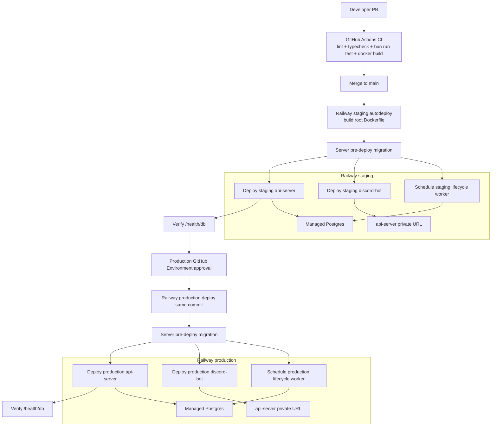

# MVP CI/CD Plan

## Summary

Use GitHub Actions as the CI gate and Railway as the deployment platform. Railway
builds the repo from GitHub with the root `Dockerfile`; GitHub does not push
runtime images for MVP. Use Railway managed Postgres with separate `staging` and
`production` environments.

Deployable components:

- `api-server`: Hono/Bun HTTP service from `apps/server`, public Railway domain,
  health checked through `/health/db`.
- `discord-bot`: long-running Discord gateway worker from `apps/bot`, no public
  port. It calls the API over Railway private networking.
- `market-lifecycle-worker`: one-shot Bun worker from
  `apps/market-lifecycle-worker`, no public port. It runs on Railway cron and
  exits after each batch.
- `postgres`: Railway managed Postgres, one database per environment.

## Key Changes

- Add one root `Dockerfile`. Use the official Bun image, install with the frozen
  lockfile, copy the monorepo, and run `bun run build`.
- Configure Railway services with these commands:
  - Server: `bun --filter @habit-gamba/server start`
  - Bot: `bun --filter @habit-gamba/bot start`
  - Worker: `bun --filter @habit-gamba/market-lifecycle-worker start`
  - Server pre-deploy migration: `bun --filter @habit-gamba/db db:migrate`
- Add GitHub Actions CI on PR and push to `main`:
  - `bun install --frozen-lockfile`
  - create CI `.env`
  - run Drizzle migrations against disposable Postgres
  - `bun lint`
  - `bun typecheck`
  - `bun run test`
  - `docker build .`
- Do not run `bun fmt` in CI. Local task completion still requires `bun fmt`,
  `bun lint`, and `bun typecheck` to pass.
- Create one Railway project with `staging` and `production` environments. Each
  environment owns `api-server`, `discord-bot`, scheduled
  `market-lifecycle-worker`, and `postgres`.
- Configure `discord-bot` `API_BASE_URL` to the private API URL:
  `http://${{api-server.RAILWAY_PRIVATE_DOMAIN}}:${{api-server.PORT}}`.
- Configure service variables for `BOT_API_TOKEN`, `DATABASE_URL`,
  `DISCORD_APPLICATION_ID`, `DISCORD_BOT_TOKEN`, `DISCORD_DEV_GUILD_ID` for
  staging only, `LOG_LEVEL`, `NODE_ENV=production`, and optional
  `MARKET_LIFECYCLE_BATCH_LIMIT`.
- Fix bot env loading so production runtime does not require
  `DISCORD_DEV_GUILD_ID`; guild id is only required when deploying staging guild
  commands.
- Add `deploy/components.json` as the source-of-truth registry for Railway
  service settings.
- Use cron `59 3 * * *` for the lifecycle worker. Railway cron is UTC and
  minute-level; this is the fixed UTC compromise for 23:59 New York during EDT.

## Diagram

## Test Plan

- CI must pass `bun lint`, `bun typecheck`, `bun run test`, and `docker build .`.
- Run the migration command against disposable CI Postgres before tests.
- Build the shared Docker image on PR before merge.
- After staging deploy, verify `/health`, `/health/db`, bot startup logs, and
  staging guild command registration.
- After staging deploy, verify worker logs show a successful one-shot run.
- Production deploy requires GitHub Environment approval, then the same health
  and log checks.

## Assumptions

- Railway is the MVP hosting platform.
- GitHub Actions owns validation; Railway owns build/deploy from GitHub.
- No GHCR or immutable image registry for MVP.
- MVP uses staging and production environments only; no ephemeral PR previews.
- Migrations run as the `api-server` pre-deploy command.
- The market lifecycle worker runs on Railway cron, not as a long-running poll
  loop.
- New deployable apps must expose `build`, `check-types`, `lint`, and `test`
  scripts, and document env requirements through `@habit-gamba/env`.
