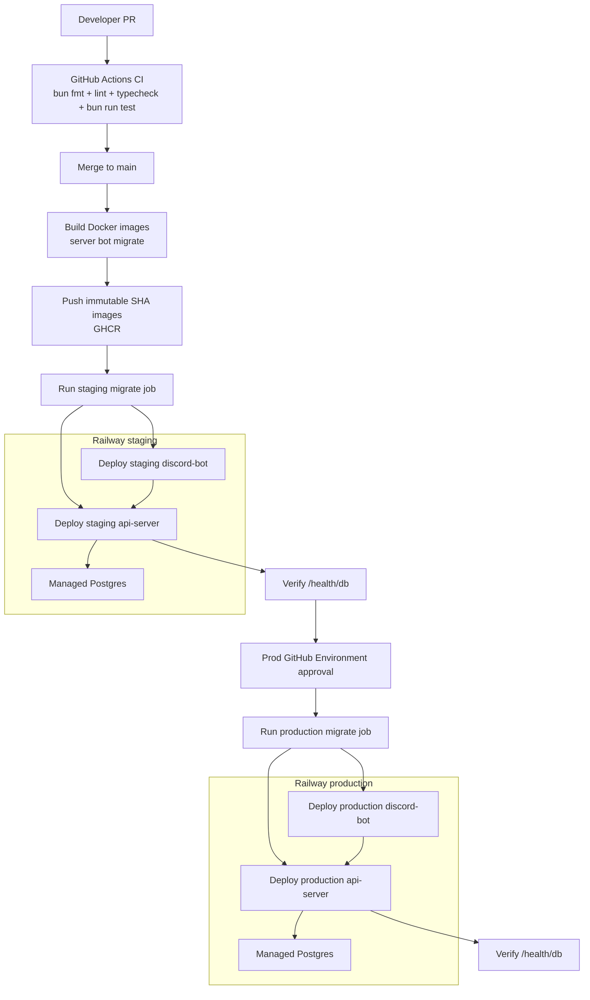

# MVP CI/CD Plan

## Summary

Use GitHub Actions as the CI/CD gate, GitHub Container Registry for immutable
images, and Railway for hosting. Use Railway managed Postgres as the production
database. Deploy two long-running services plus one migration job per
environment.

Deployable components:

- `api-server`: Hono/Bun HTTP service from `apps/server`, public Railway domain,
  health checked through `/health/db`.
- `discord-bot`: long-running Discord gateway worker from `apps/bot`, no public
  port.
- `db-migrate`: one-shot Bun container that runs Drizzle migrations before each
  deploy.
- `postgres`: Railway managed Postgres, one database per environment.

## Key Changes

- Add one root `Dockerfile` with targets for `server`, `bot`, and `migrate`.
  Use the official Bun image, install with the frozen lockfile, copy the
  monorepo, and run `bun run build`.
- Use these runtime commands:
  - Server: `bun apps/server/src/index.ts`
  - Bot: `bun apps/bot/src/index.ts`
  - Migration: `cd packages/db && bun src/migrate.ts`
- Add GitHub Actions:
  - `ci.yml` on PR and push: `bun install --frozen-lockfile`, `bun fmt`,
    `bun lint`, `bun typecheck`, `bun run test`.
  - `image.yml` after CI on `main`: build and push
    `ghcr.io/jkufa/habit-gamba/server:<sha>`,
    `ghcr.io/jkufa/habit-gamba/bot:<sha>`, and
    `ghcr.io/jkufa/habit-gamba/migrate:<sha>`.
  - `deploy-staging.yml`: run staging migration, deploy server, deploy bot, and
    verify `/health/db`.
  - `deploy-prod.yml`: same flow as staging, gated by GitHub Environment
    approval.
- Create one Railway project with `staging` and `production` environments. Each
  environment owns `api-server`, `discord-bot`, and `postgres` services.
- Configure `DATABASE_URL` from Railway Postgres, `API_BASE_URL` for the bot, and
  service secrets for `BOT_API_TOKEN`, `DISCORD_APPLICATION_ID`,
  `DISCORD_BOT_TOKEN`, `DISCORD_DEV_GUILD_ID`, `LOG_LEVEL`, and
  `NODE_ENV=production`.
- Add `deploy/components.json` as a component registry. Each deployable component
  declares its package, Docker target, Railway service, public/private exposure,
  health check, and required environment variables. GitHub Actions should read
  this registry as a matrix so future components onboard by adding a package,
  Docker target, and registry entry.

## Diagram

## Test Plan

- CI must pass `bun fmt`, `bun lint`, `bun typecheck`, and `bun run test`.
- Build all Docker targets on PR before merge.
- Run the migration container against disposable CI Postgres.
- After staging deploy, verify `/health`, `/health/db`, and bot startup logs.
- After production deploy, run the same health checks before marking the deploy
  complete.

## Assumptions

- Railway is the MVP hosting platform.
- GitHub Actions owns validation, image builds, and deployment promotion.
- GitHub Container Registry stores immutable SHA-tagged runtime images.
- MVP uses staging and production environments only; no ephemeral PR previews.
- Migrations run as a one-shot job before app and bot rollout.
- New deployable apps must expose `build`, `check-types`, `lint`, and `test`
  scripts, and document env requirements through `@habit-gamba/env`.
