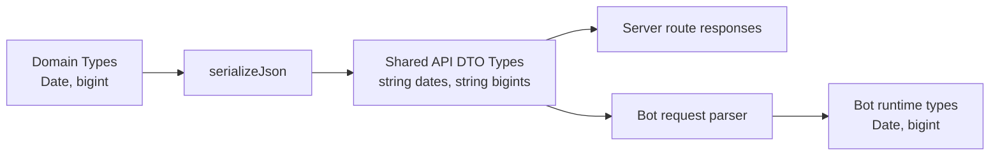

# Strongly Typed API Boundary

## Goal

Remove TypeScript `any` from API-facing code and make server-to-bot response contracts explicit enough that DTO shape drift is caught by `tsc` and tests, not Discord runtime.

This plan targets real TS `any` usage, not Vitest's `expect.any(...)` matcher.

## Current Gaps

- `apps/bot/src/service.ts` treats all response data as `any` after `fetch().json()`:
  - `request()` returns `payload.data as any`.
  - parser functions accept `any`, so missing fields like `market.contracts` are invisible to TypeScript.
- `apps/server/src/app.test.ts` has `ApiResponse.data?: any`, which hides response-shape mistakes in server tests.
- Server has Zod schemas for request bodies in `apps/server/src/schemas.ts`, but no shared typed response DTOs for bot/server contracts.
- Runtime JSON serialization in `apps/server/src/http.ts` converts `Date` and `bigint`, but that serialized type is not represented in shared TypeScript types.

## Desired Shape

Create one shared API contract layer that describes JSON DTOs as sent over HTTP, then use it from both server and bot.

## Implementation Plan

### 1. Add Shared API DTO Package

- Create `packages/api` with no runtime dependencies unless Zod response validation is chosen.
- Define JSON-safe utility types:
  - `JsonPrimitive`
  - `JsonValue`
  - `Serialized<T>` that maps `Date -> string`, `bigint -> string`, arrays, tuples, and objects recursively.
- Define named response contracts used by bot:
  - `ApiOk<T> = { data: Serialized<T> }`
  - `ApiErrorResponse`
  - `CreateMarketResponse`
  - `ResolveMarketResponse`
  - `CancelMarketResponse`
  - `BuyMarketResponse`
  - `PositionsResponse`
  - `RefreshTradesResponse`
  - `AccountResponse`
- Use domain package exported types as inputs where possible:
  - `ExchangeMarketView`
  - `ExchangeBuyResult`
  - `ResolveMarketResult` with overridden hydrated `market`
  - `CancelMarketResult` with overridden hydrated `market`
  - wallet/user types as needed.

### 2. Type Server Response Helpers

- Change `apps/server/src/http.ts`:
  - Make `ok<T>(data: T): ApiOk<T>` return serialized DTO type instead of `{ data: unknown }`.
  - Make `serializeJson<T>(value: T): Serialized<T>`.
- Update route handlers in `apps/server/src/app.ts` so response values have named DTO types where shape matters.
- Add `satisfies` checks on composite responses such as resolve/cancel:
  - `const response = { ...result, market: hydratedMarket } satisfies ResolveMarketResponse;`
  - This catches raw `schema.markets` being returned where hydrated `ExchangeMarketView` is required.

### 3. Type Bot HTTP Client

- Replace `request(...): any` with generic request:
  - `async function request<T>(...): Promise<Serialized<T>>`
- Each command passes expected DTO type:
  - `request<ResolveMarketResponse>(...)`
  - `request<CancelMarketResponse>(...)`
  - `request<ExchangeMarketView>(...)`
- Replace every parser parameter `any` with DTO input type:
  - `parseMarket(value: Serialized<ExchangeMarketView>): BotMarket`
  - `parseBalance(value: Serialized<BotBalanceDto>): BotBalance`
  - `parseRefreshTrade(value: Serialized<MarketRefreshTradeDto>): MarketRefreshTrade`
- Keep parser functions as conversion boundary from JSON DTOs to bot runtime types.

### 4. Remove Test `any`

- In `apps/server/src/app.test.ts`, replace:
  - `data?: any`
- With:
  - `data?: unknown` for generic helpers, plus narrow typed helpers where assertions need shape.
  - Or `async function jsonData<T>(response: Response): Promise<T>` that reads `ApiOk<T>`.
- Prefer named DTO types in tests for resolve/cancel shape assertions.

### 5. Enforce No Explicit `any`

- Add lint guard after cleanup:
  - With current `oxlint`, enable or verify `typescript/no-explicit-any` equivalent if supported by repo config.

## Test Plan

- Keep existing regression tests from Market Resolve DTO Fix.
- Add type-level tests in shared contract package where useful:
  - `Serialized<{ id: string; at: Date; amount: bigint }>` produces `{ id: string; at: string; amount: string }`.
  - tuple contracts stay tuple-shaped for binary markets.
- Add server compile-time `satisfies` checks for response DTOs.
- Add bot service tests that mock typed DTO responses for:
  - resolve market
  - cancel market
  - account balance
  - positions list
  - refresh trades
- Run:
  - targeted package tests
  - `bun fmt`
  - `bun lint`
  - `bun typecheck`
  - final no-explicit-any check.

## Migration Order

1. Introduce shared serialized DTO utilities and response types.
2. Type `ok()` / `serializeJson()` without changing runtime behavior.
3. Convert bot `request()` to generic typed DTO return.
4. Convert parser inputs from `any` to serialized DTO types one parser at a time.
5. Replace test `ApiResponse.data?: any`.
6. Add no-explicit-any enforcement once codebase is clean.

## Non-Goals

- Do not rewrite transport layer or replace Hono.
- Do not remove runtime parsers; bot still needs to convert JSON strings back to `Date` and `bigint`.
- Do not add defensive fallbacks for malformed server DTOs unless paired with tests. Strong contract should fail loudly in development.
